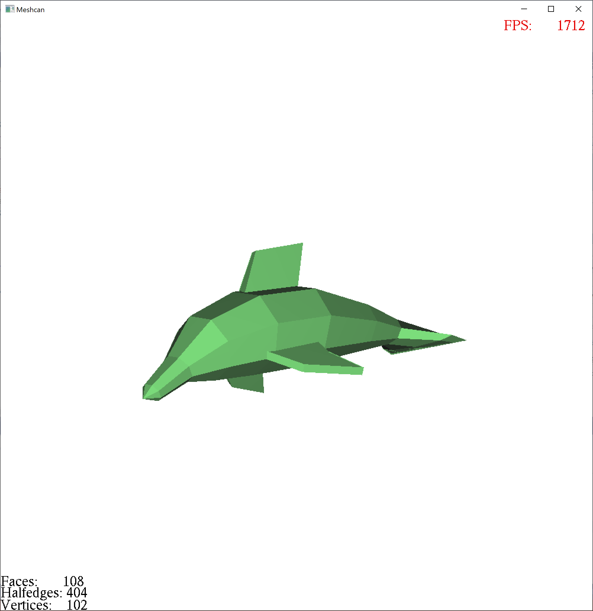
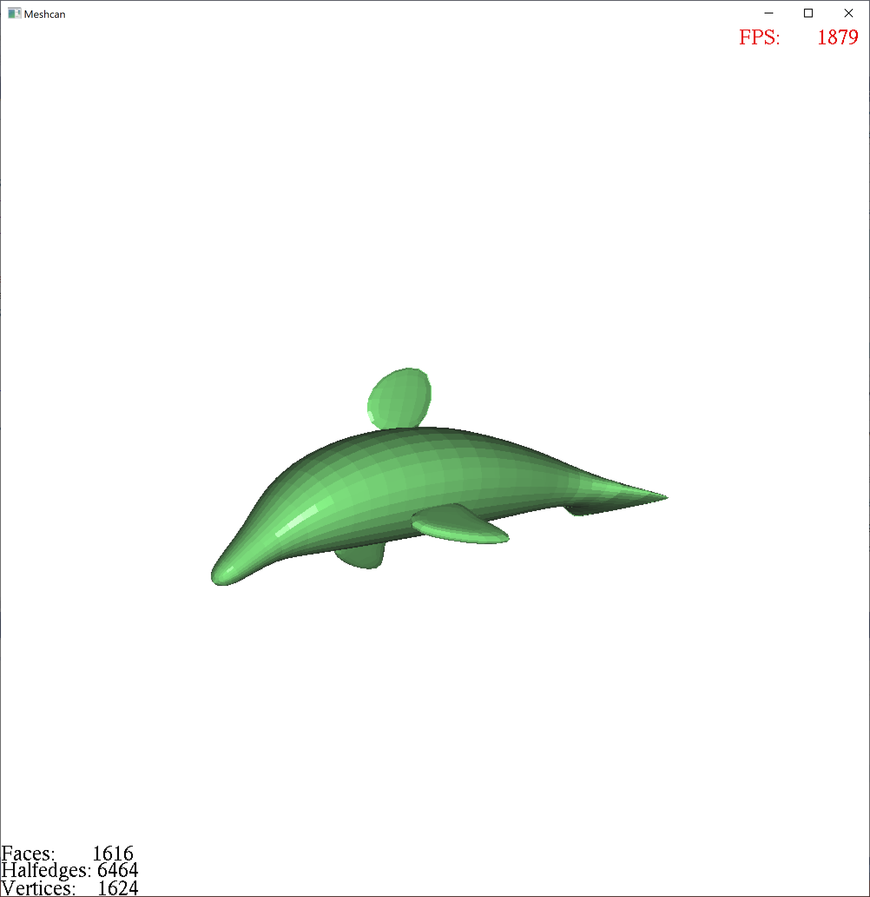
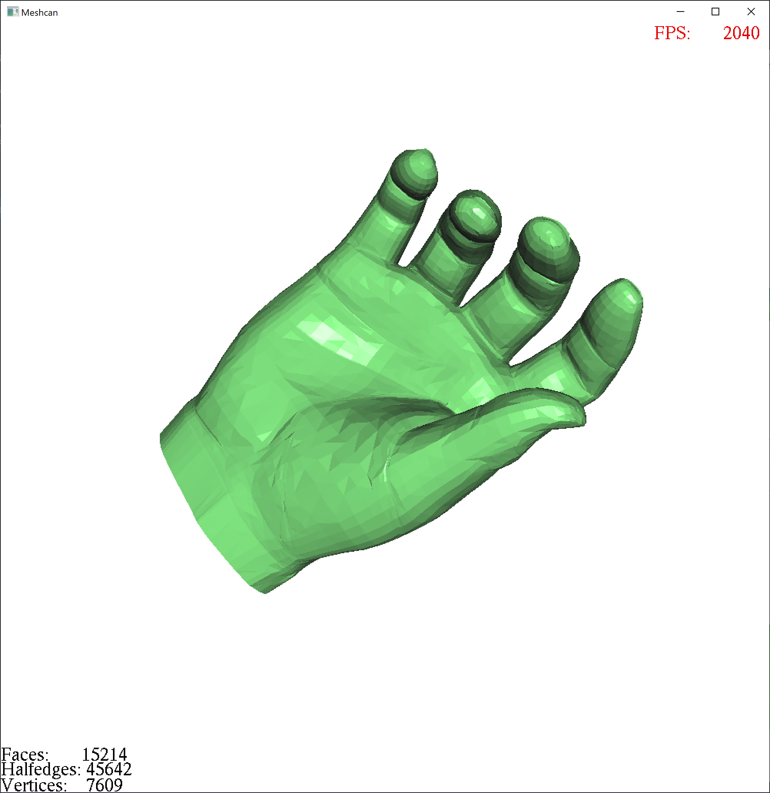
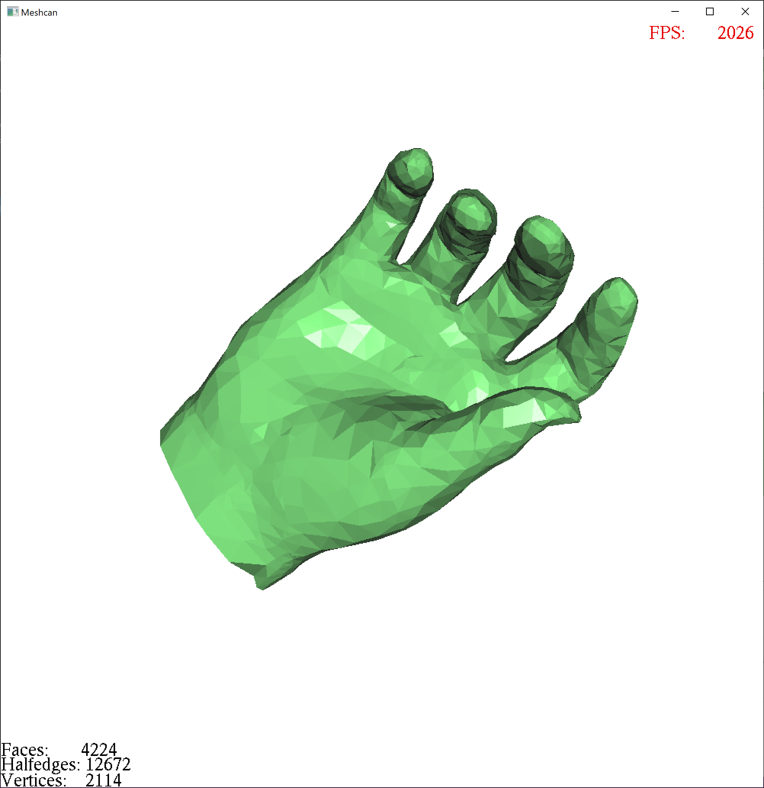

# Meshcan

This serves as my final project for **Computational Geometry** course **2017 Spring**. It's not optimized by then, so I may continue improve it randomly for fun. Should be a good playground for me trying some parallel computing technologies.

Original | Catmull–Clark subdivision
:---:|:---:
 | 

Original | Mesh simplification
:---:|:---:
 | 

## Features
- Some typical mesh operations
- Catmull–Clark subdivision 
- Mesh simplification

## To-do
- Multithreading and SIMD
- Basic GUI and file IO functions
- Display animated mesh modification parallelly when processing the mesh data.

## To-fix
Crash while the mesh got over simplified.